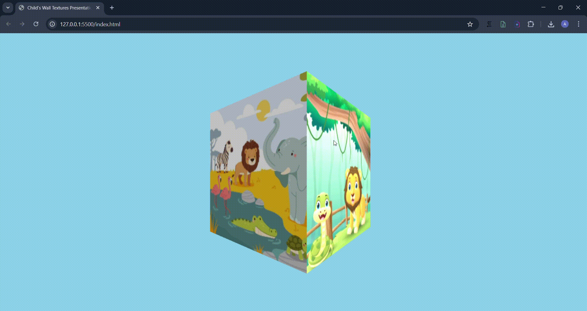

# 3D Child Room Textures - Interactive Presentation

## Project Demo
 
*(Note: Replace 'your-animation-name.gif' with the actual filename you uploaded)*

## Overview
This project is an interactive 3D scene designed as a wall texture presentation for a 5-year-old's room. It demonstrates core computer graphics concepts such as **Texture Mapping**, **Illumination**, and **3D Transformations** using the **Three.js** library.

## Features
* **3D Geometry:** Uses `THREE.BoxGeometry` to create a 3D block representing room walls.
* **Texture Mapping:** Features 4 high-quality, child-friendly jungle and animal textures mapped to the vertical faces of the cube.
* **Illumination:** A combination of `AmbientLight` (for base visibility) and `DirectionalLight` (to provide depth and highlights) ensures the textures are vibrant.
* **Animations:** The object performs a continuous **clockwise rotation** to showcase all textures.
* **Interactivity:** Integrated `OrbitControls` allowing the user to rotate, tilt, and interact with the 3D object using mouse/touch.

## Technical Implementation
* **Library:** Three.js (WebGL-based)
* **Rotation Logic:** `cube.rotation.y -= 0.005` (Clockwise)
* **Materials:** `MeshStandardMaterial` to react properly to the light sources.

## How to Run
1. Clone this repository.
2. Open `index.html` using a local server (e.g., VS Code Live Server) to avoid CORS issues with textures.
3. Or, visit the live demo via GitHub Pages: `[YOUR-GITHUB-PAGES-LINK-HERE]`

## Technologies Used
* HTML5 / CSS3
* JavaScript
* Three.js Library
